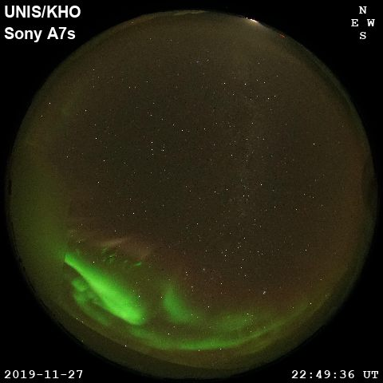

# Effect of resampling filter for generating quicklook images

The raw data from the Sony A7s all-sky imager at Kjell Henriksen Observatory are 2832x2832 RGB-images stored in JPG-format. For general browsing of data smaller quicklook images (480x480) are often sufficient.

If there is no aurora in the image, there are two options: 
1. The clouds prevent the observation of aurora above the clouds, or
2. The skies are clear and there simply is no aurora to be seen.

To separate these cases, one can try to see stars (or the Moon) in the image. So, we would like to be able to see stars also in the quicklook images.

"Better" interpolation methods used for resizing the image use a smoothing filter before resampling. Unfortunately, this usually removes the stars from the quicklook images by removing high-frequency "spikes" (stars), which is what you usually want to do from the signal processing point of view. Here are two quicklook examples with the first being the result of using the default resampling filter with PIL.Image.resize() and the second using the nearest neighbour resampling.

Note: the nearest neigbour method introduces artifacts as stars either are or are not the nearest neighbour of the new sampling grid. For example, this causes extra "flickering" of stars when using quicklook images as movie frames due to the apparent motion of stars in the sky. 

